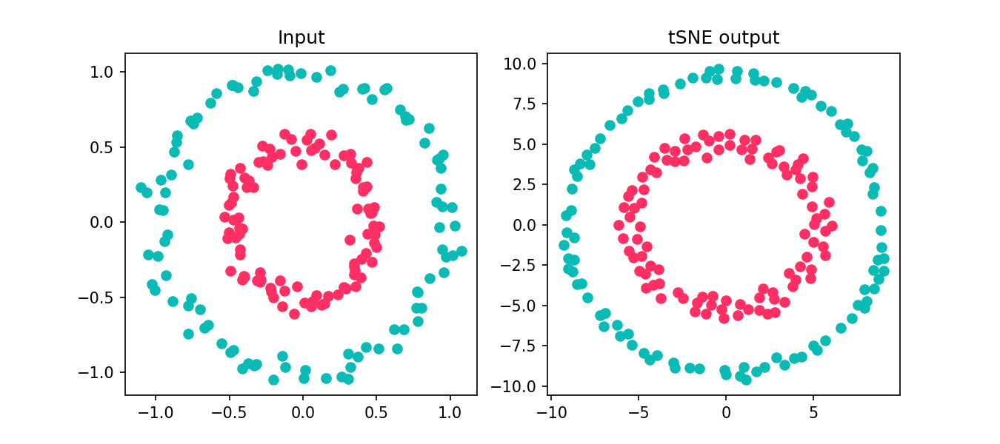

# t-SNE PyTorch Implementation With CUDA

A [pytorch](https://pytorch.org) implementation of the tSNE algorithm described in [Visualizing Data using t-SNE](https://lvdmaaten.github.io/publications/papers/JMLR_2014.pdf) with CUDA acceleration.

## Installation

Clone this repository and install it plus the required packages using [uv](https://docs.astral.sh/uv) as follows:

```bash
uv pip install -e .
```

This will install a `torch-tsne` entrypoint and the required packages defined in the `pyproject.toml` file (or if available, `uv.lock`).

To allow for importing `TorchTSNE` in other  projects without installation, just add the path of the repository root to your PYTHONPATH as follows:

```bash
export PYTHONPATH=$PYTHONPATH:$(pwd)
```

## How to use it

To embed a dataset using `torch-tsne` given the desired input file and labels (and the `-v` verbose option to see what's happening under the hood), run:

```bash
torch-tsne -x mnist2500_X.txt -y mnist2500_labels.txt -o images/pytorch.png -v

Using random seed 42
Using device cuda
Running initial PCA...
Computing initial p-values...
Fitting tSNE...
Error: 16.082:   8%|██              |   82/1000 [00:01<00:06, 131.19it/s]
Switching momentum to 0.8
Error: 1.097:  100%|████████████████| 1000/1000 [00:04<00:00, 224.89it/s]
```

The code will automatically detect if a CUDA enabled GPU is available and make use of it.

***Note:*** The input data should be normalized to the range [0.0, 1.0], otherwise you may get 'nan' results.

### Using the TorchTSNE Class

```python
import matplotlib.pyplot as plt
from sklearn.datasets import make_circles
from torch_tsne import TorchTSNE as TSNE

# create a dummy dataset using sklearn
X, y = make_circles(
    n_samples=200, factor=0.5, noise=0.05, random_state=0
)

# create a torch-tsne tSNE object
tsne = TSNE(
    n_components=2,
    random_state=42,
    perplexity=30.0,
    max_iter=1000,
)

# fit the tSNE like other sklearn objects
Y = tsne.fit_transform(X, verbose=True)

# visualize and save the result
one, two = y == 0, y == 1
fig, axes = plt.subplots(1, 2, figsize=(9, 4))
axes[0].scatter(X[one, 0], X[one, 1], c="#0ABAB5")
axes[0].scatter(X[two, 0], X[two, 1], c="#FF2E63")
axes[0].set_title("Input")
axes[1].scatter(Y[one, 0], Y[one, 1], c="#0ABAB5")
axes[1].scatter(Y[two, 0], Y[two, 1], c="#FF2E63")
axes[1].set_title("tSNE output")
plt.savefig("images/circles.png", dpi=150)
plt.close(fig)
```

The result should look something like this:



## Credit

This code is inspired by https://lvdmaaten.github.io/

The original repository is by https://github.com/mxl1990/tsne-pytorch

This code is based on additional optimizations by https://github.com/palle-k/tsne-pytorch
